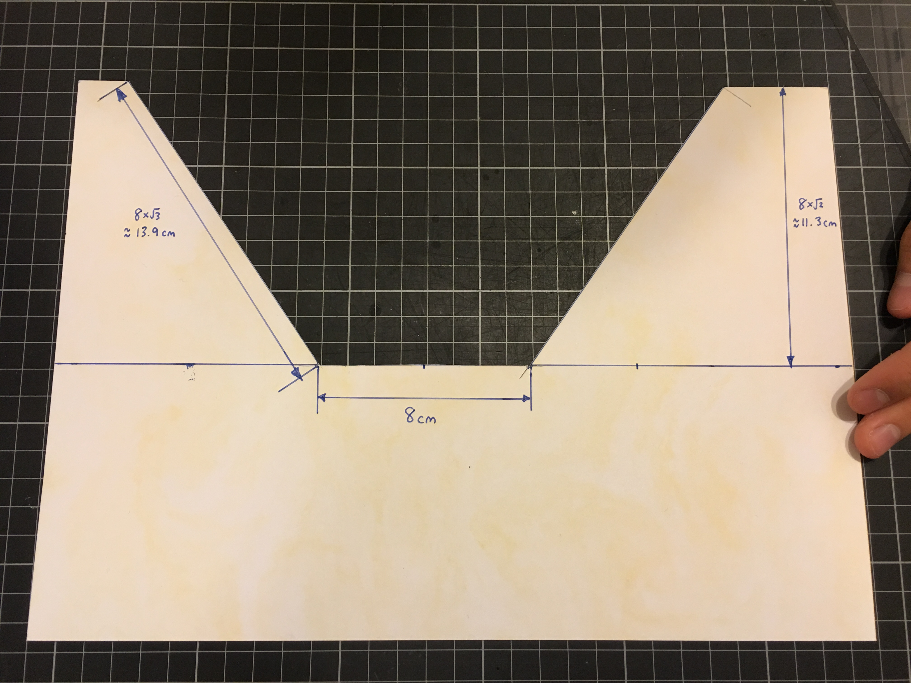
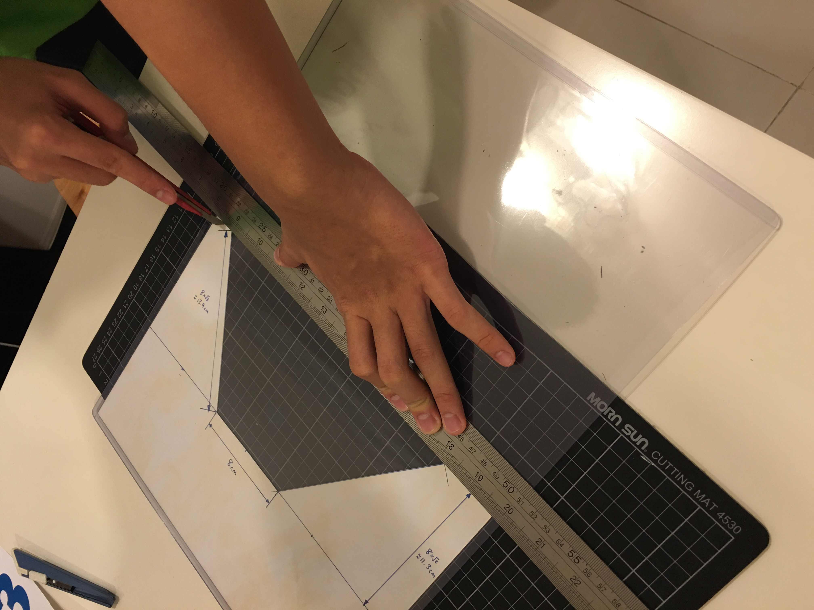
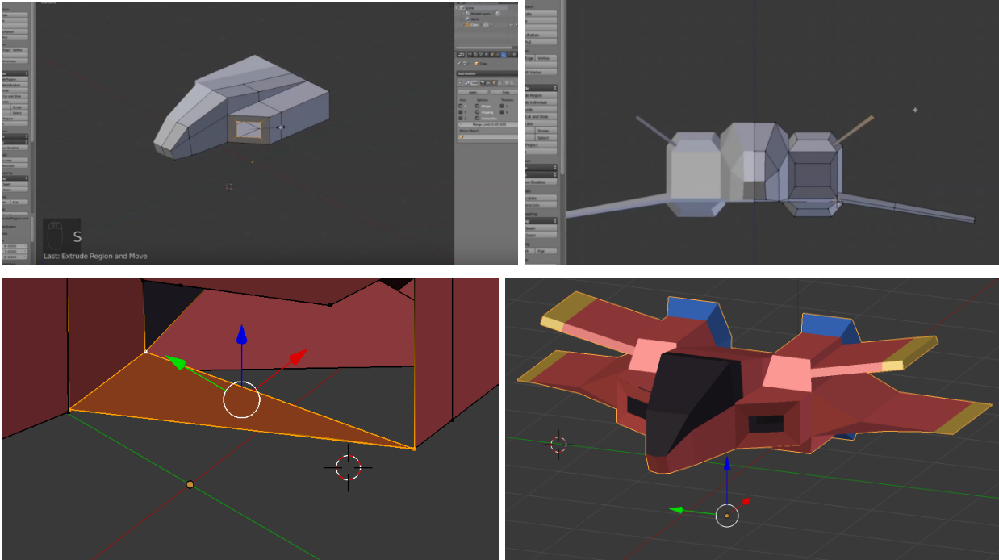
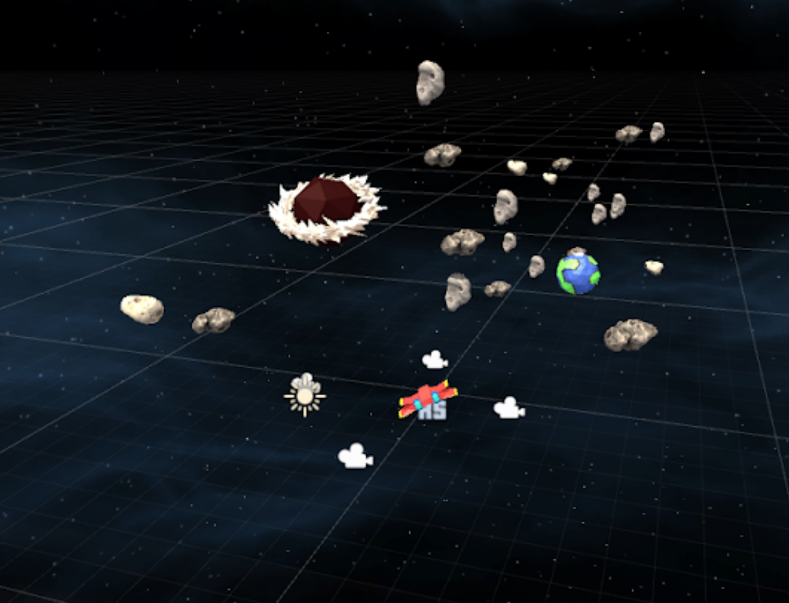
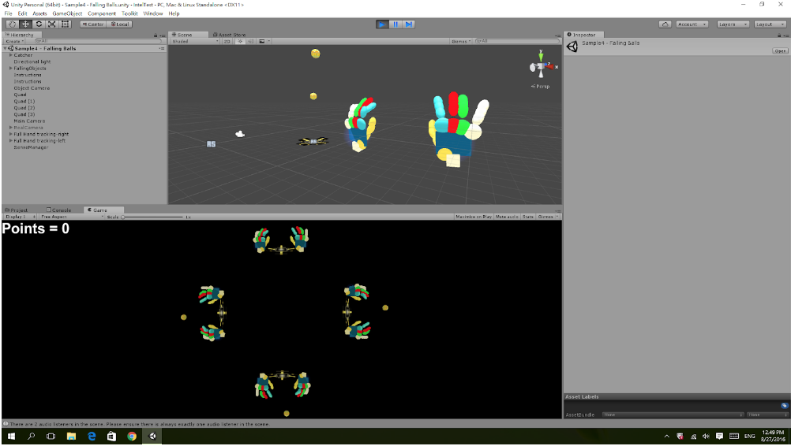
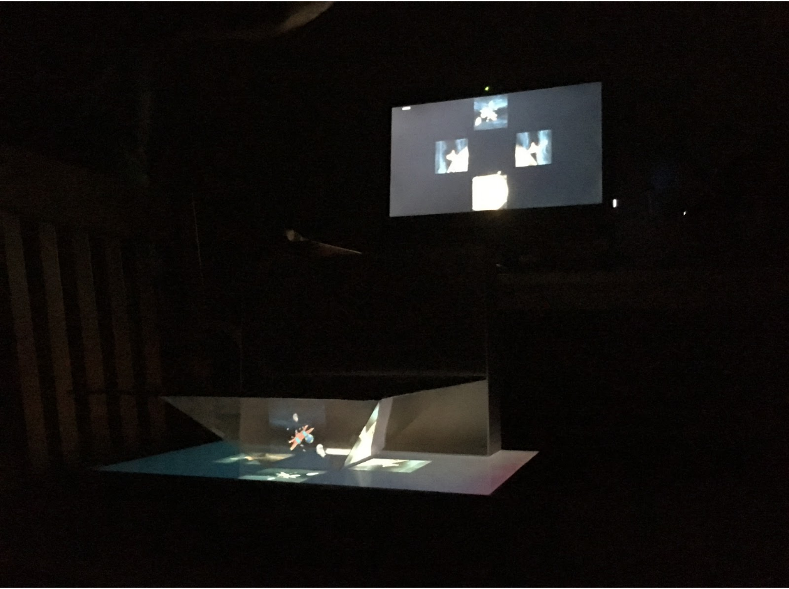
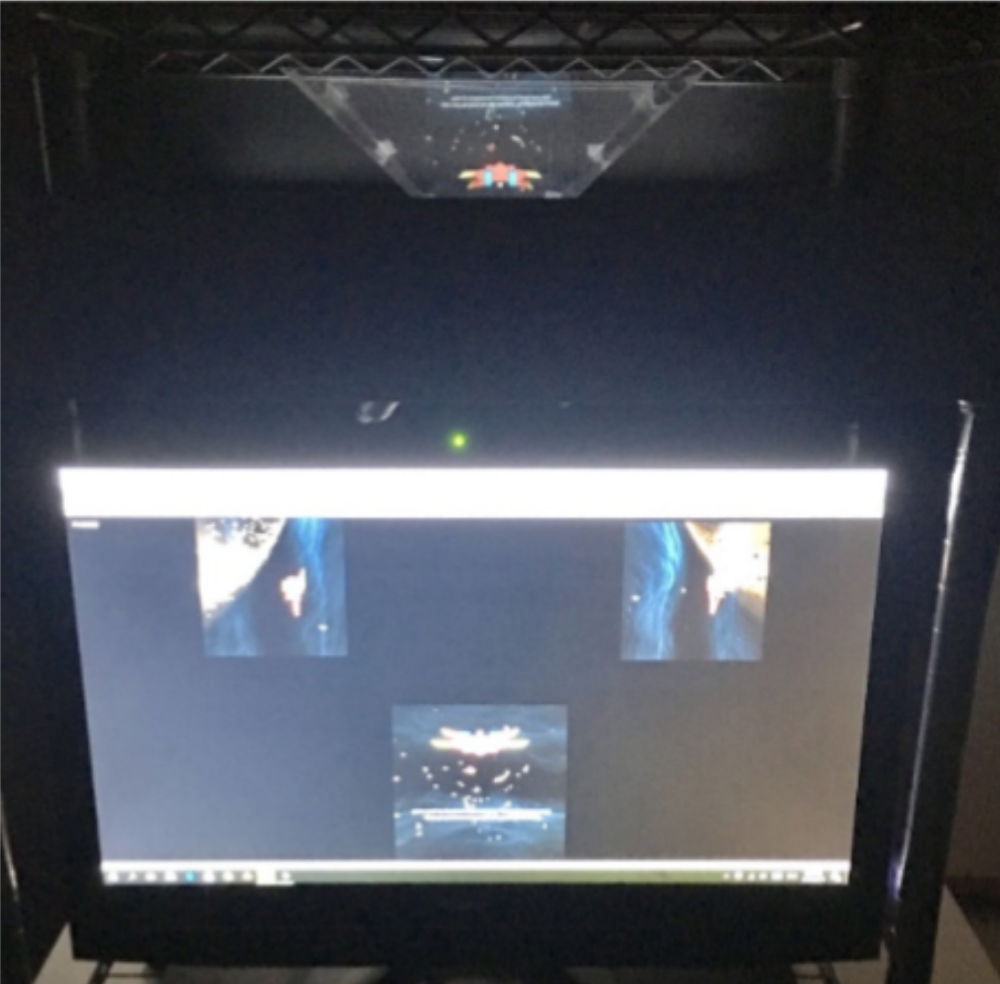
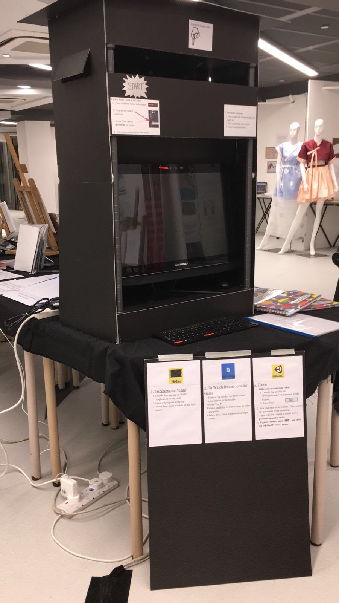

# Personal-Project
Motion-controlled 3D Asteroids game with hologram-like aesthetics / Hologram Illusion Project

### Description
This Hologram Illusion Project is, to my knowledge, the first interactive holographic game ever. The main purpose is to actualize a dream that I had since I was a kid: interacting with holograms, just like in sci-fi movies. Being a playful person at heart, the prospect of bringing this idea to fruition is excited and inspired me to try my hand at game development. 

In this project, I used a webcam to track the user's hand to play a reworked 'Asteroids' game. The objective is for the player to survive as long as possible navigating through waves of obstacles. I used Unity and C# to program the game mechanics, Intel Realsense to create the motion tracking software, and Blender to compile the game models, all of which I learned myself using online tutorials and documentation. For the hardware, I cut up PVC sheets to create a plastic dome, which will be the medium that creates the holographic effect. I also utilized interdisciplinary knowledge ranging from aesthetics and user psychology to create an engaging product. 

I faced many challenges during this project. For one, I could not find a lot of information or guidance online as no one has attempted to create a holographic game before. However, by preserving through the creation process, researching about technical solutions and the psychology of gaming, and conducting many user trials, I overcame these hurdles and developed a game that challenges the visual boundaries of traditional gaming. 

This was part of our graduation requirement for the Middle Years Programme, where we were offered the opportunity to apply our existing skills to create a significant piece of work over the Year 10/11 summer.

### Showcase Video

### Measurements of the Glass Dome

Previously, the small glass dome served as a proof of concept for the possibility of creating a display for holograms. 

I first created my first prototype using hard paper. Using my knowledge of optics, I knew that the glass piece had to be positioned at 45 degrees to the computer screen to create the clearest reflection. Thus, based on the measurements of my computer display, I used trigonometry to calculate the exact proportions I should cut out to maximize the size and effect of the hologram image.

### Cutting the Plastic Pieces

Yet, when I wanted to make the actual dome, I realized that glass as a material is expensive, fragile and difficult to obtain. At this point, I was stuck at a roadblock, as the glass was a major part of what I envisioned.

My father, as an engineer, provided a lot of insightful support that improved the final product. He suggested using PVC card for my second prototype iteration. Through this process, I found that PVC is a very transparent, strong and cheap material that created clear hologram-like images. Thus, I ultimately decided to use PVC, instead of glass, for the construction of my final dome.

### Creating Low Poly Models with Blender

With no prior experience, I taught myself how to use Blender, a free 3D modeling software. Following the documentation and tutorials online, I created my player spaceship and background planetary models. During this process, I consulted my school alumni, Ethelia, who was a third-year university student studying New Media Design and Imaging. 

Over coffee, she shared her experiences and approaches in creating engaging user-experiences. She also suggested making the theme of the game simple and futuristic, as it would augment the holographic effect even more. Her advice was very helpful, as it convinced me to adopt the space platformer idea, as well as to favor low-poly designs over realistic models.

### Unity Game Mechanics

Now that I had a better understanding of the holographic effect, it was time to create the actual contents of the game. I have never used Unity before, so I had to learn the software by accessing online tutorials. 

Since the game was an endless space platformer, I had to figure out a way to conserve game resources. My solution was to add an invisible 'net' behind the player spaceship. As the player flies through the game space, the 'net' will pick up all the untouched planets/asteroids and reposition them to a location ahead of the player. Thus, resources will always be conserved. 

While the debugging process was challenging and discouraging, the feeling of accomplishment at the end of each coding session was exhilarating.

### Hand Tracking Software

Time for the hardest part of my project: the hand tracking software. It was difficult to find any tutorials or resources on this subject online, so I was stuck for many months. Eventually, I came across the Intel Realsense module, which implemented the hand tracking software into Unity. However, I had to alter parts of it to fit my project. This meant spending many hours browsing through the C# documentation and testing out different solutions. This was particularly tough for me, as I had no prior knowledge about C#, so I had to pick it up as I worked through the project. By persisting with systematic logic, I was able to successfully implement the hand tracking software. I am very proud of this achievement.

### Comfortable User Experience

I immediately spotted a big problem. A clear holographic image is created when the glass dome is placed on top of a computer screen, and thus my display must be laid flat on the table. However, with the webcam facing the same direction as the screen (the green dot in the picture), that meant that users will have to rotate their hand downwards, something that felt weird upon testing. This error was unaccounted for while I was designing my hologram, so I was quite stuck for a while.

To solve this problem, I had to turn my thinking around. Since these two parts have to face different directions, I decided to use 2 displays, reusing an old computer we kept at home. By screen sharing, I can have the first computer (with the webcam) upright, while the second computer (screen sharing) will be on its back, displaying the hologram visuals and creating the illusion. This ensured a comfortable user experience, which I felt was an important part of this project.

### Putting it together

Another mistake that I made was how I can maintain a clear image of the hologram visuals. Since it was just a reflection, external light sources can interfere with the clarity of the image. This meant that I had to figure out how to create an artificial dark room around my hologram.

Going back to the drawing board, I decided to stack the hologram display on top of the computer. The structure is built with a shelf that I bought and compiled from IKEA. With this design, it allowed me to wrap dark cardboard around the hologram display in order to block most lighting. As an added bonus, the displays are positioned in a way such that the hologram is positioned at eye level, while the webcam is positioned where the user's hand would be. This will make the user experience even more comfortable.

### Final Product Showcase in School Exhibition

This is a picture of my final product, placed on display in my school's exhibition. To make it easier to play, I placed instructions all over the product, as well as added video instructions to help guide new users. I also added flaps at the sides, so that other people can look at the hologram from different positions.
